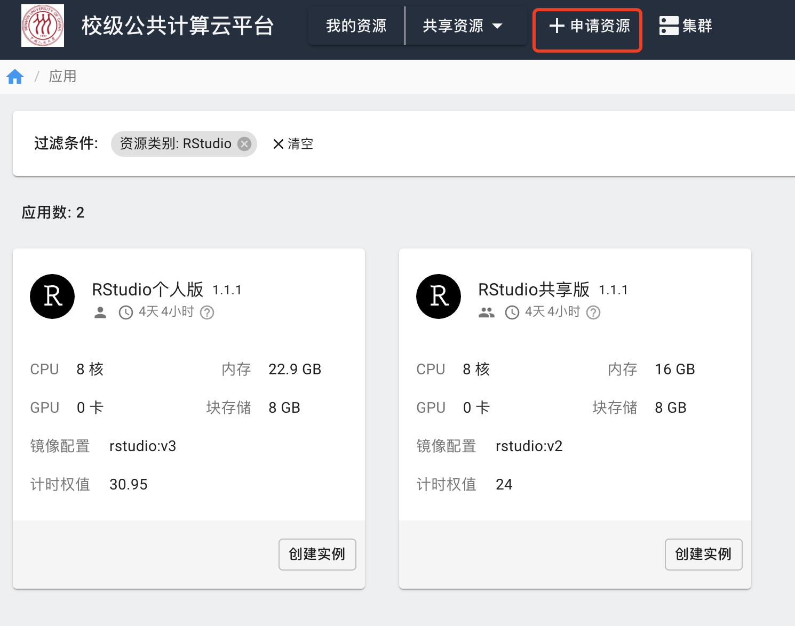
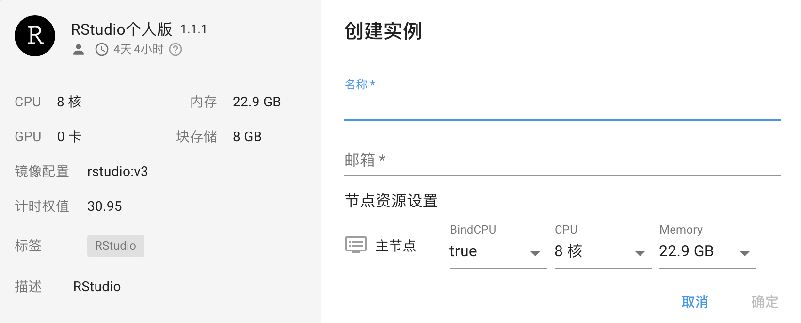

# RStudio

RStudio 是 RStudio 公司打造的一款基于 Web 的开源IDE。计算云提供了两种模式的RStudio：

1. 多人共享模式的RStudio容器实例，可供多人团队共享使用。
2. 个人版RStudio，仅自己可用。

## 多人共享模式的RStudio

### 创建共享项目

RStudio实例可以被多人共享，可以由课题组中一人创建，并邀请课题组其他人加入该RStudio实例。我们只对创建人进行计费。

要创建共享模式使用的实例，需要先创建**共享项目**：


计算云后端会为**共享项目**在系统中创建一个用户组，并给这个用户组在共享文件系统上分配一个组Home目录。**共享项目**适用于某个团队或某个课题组共用某些实例的场景。

### 邀请其他用户共享使用

如果希望其他用户共享使用此实例，则可以在此共享项目界面的**用户**子页面中**邀请**其他用户加入此共享项目。点击界面右上角的用户名，可以看到用户ID。邀请前，需要先与该用户沟通，获取该用户ID，然后根据用户ID搜索到用户。


当然，我们也可以创建一个共享项目，共享项目中只有自己本人。

### 申请RStudio应用实例

RStudio属于交互实例，在**申请资源**界面里申请：




## 个人版RStudio

RStudio个人版仅自己可见可用，申请资源时，注意选择“RStudio个人版”的实例。

## 启动与登录


由于RStudio是共享交互实例，需要用计算云的用户名和密码登录。

!!! warning "用户名和密码"
    首次登录需要设置登录密码，密码在右上角用户名下“重置密码”处设置。
    输入用户名时，前面要加上小写的u，比如学工号为 20200002，输入为：u20200002。


## 简单示例


## 软件包和数据

!!! note "软件和数据"
    用户可以在 RStudio 实例中安装自己所需的包、上传自己的数据。释放资源后，这些软件依然保存在镜像中，下次使用，可以在“资源回收”页面恢复，该实例将恢复至“我的资源”页面，这些包和数据不会被清理删除，用户可继续使用它们。

### 软件包安装

R语言本身有丰富的第三方软件包，一般情况下，使用`install.packages("package-name")`来安装所需的包。例如，我们安装`data.table`包：


如上图所示，R会帮我们从远程仓库中下载这些包，并进行一些编译工作，如果安装正常，会显示：

```
installing to /home/u20110142/R/x86_64-pc-linux-gnu-library/4.0/00LOCK-data.table/00new/data.table/libs
** R
** inst
** byte-compile and prepare package for lazy loading
** help
*** installing help indices
** building package indices
** installing vignettes
** testing if installed package can be loaded from temporary location
** checking absolute paths in shared objects and dynamic libraries
** testing if installed package can be loaded from final location
** testing if installed package keeps a record of temporary installation path
* DONE (data.table)
```

可以看到，这个包成功安装在了`/home/user-id/R/..`的个人HOME目录下了。

使用`install.packages("package-name")`可以安装绝大多数的包，个别情况下，会一些安装错误，这主要是因为：这个包依赖了其他包，其他依赖了操作系统的一些底层包，目前我们的操作系统缺少这个底层包。比如，我们想安装包`tidyverse`，安装过程中报错：

```
ERROR: dependency ‘xml2’ is not available for package ‘rvest’
```

这主要是因为`tidyverse`依赖了`rvest`，`rvest`又依赖了`xml2`。这时候，我们可以先安装一下`xml2`：`install.packages("xml2")`。在安装`xml2`的过程中，报以下错误：


这个报错的意思是：当前的操作系统缺少某个底层包。我们的RStudio所使用的操作系统为Ubuntu，在Ubuntu中该包名字为`libxml2-dev`，我们可以切换到Terminal中，使用`sudo apt-get install libxml2-dev`来安装这个包，如下所示：


安装好操作系统包后，再切换会R的Console，继续安装刚才报错的包`xml2`、`rvest`和`tidyverse`即可。

### 数据上传

我们可以使用RStudio自带的文件管理和上传工具，也可以用计算云提供的文件传输与数据管理功能，计算云的文件传输详见[文档](../manual/transfer.md)。